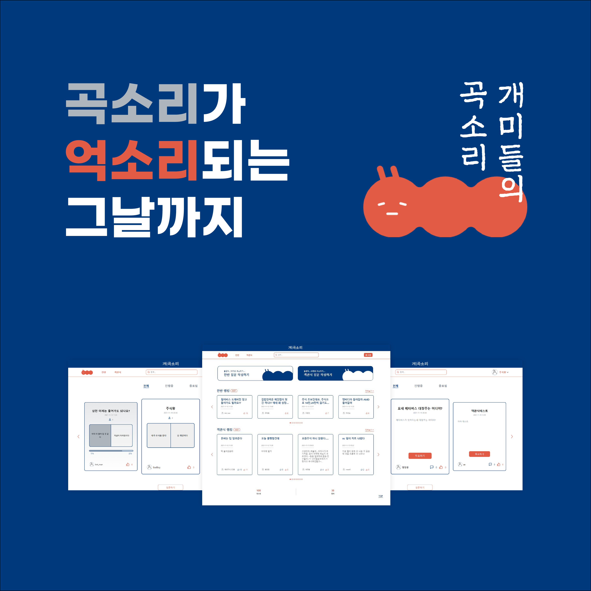

# 개미들의 곡소리

## 목차

### 1. [프로젝트 소개](#프로젝트-소개)

### 2. [팀 구성](#팀-구성)

### 3. [기술 스텍](#기술-스텍)

### 4. [기능](#기능)

### 5. [Troubleshooting](#Troubleshooting)

## 프로젝트 소개

개미들의 곡소리는 주식 투자에 대한 의견과 고민을 투표 형식으로 쉽고 간단하게 해결할 수 있는 커뮤니티 사이트 입니다. 주식 투자에 대한 관심이 높아짐에 따라 많은 개미 투자자들이 유입되었고, 이들의 고민을 부담없이 간편하게 해결하는데 도움이 되고자 프로젝트를 진행하게 되었습니다.

### 시연 영상 [youtube]()

### Github [Organizations](https://github.com/Ant-DDun-DDun-Project)

### Project 정보 [Notion](https://crawling-health-e0d.notion.site/Project-3b911ebdb6114fb7be4b54956a9579dd)

## 팀 구성

[팀 소개 페이지](https://crawling-health-e0d.notion.site/be6df84bde484ca883f54739be96eb8f)

<table>
  <tr>
  <td>
  Backend
  <td></td>
  </td>
  <td>
  Frontend
  <td></td>
  </td>
  <td>
  Designer
  <td></td>
  </td>
  <tr>
  <td align="center">
    </td>
    <td align="center">
     <b>김정호</b></a>  
    <a href="https://github.com/jeangho293">Github</a>
    </td>
    <td align="center">
    </td>
    <td align="center">
     <b>김갑민</b></a> 
    <a href="https://github.com/gabmin" >Github</a>
    </td>
    <td align="center">
    </td>
    <td align="center">
     <b>김예은</b></a> 
    </td>
    <tr>
    <td align="center">
    </td>
    <td align="center">
     <b>조윤재</b></a>  
    <a href="https://github.com/Yunjaejo">Github</a>
    </td>
    <td align="center">
    </td>
    <td align="center">
     <b>박시영</b></a>  
    <a href="https://github.com/larisms">Github</a>
    </td>
    <td align="center">
    </td>
    <td align="center">
     <b>김한비</b></a>  
    </td>
    </tr>
    <tr>
    <td align="center">
    </td>
    <td align="center">
     <b>황창환</b></a>  
    <a href="https://github.com/changchanghwang">Github</a>
    </td>
    <td align="center">
    </td>
    <td align="center">
     <b>장원배</b></a>  
    <a href="https://github.com/calvin9150">Github</a>
    </td>
    <td></td><td></td>
    </tr>
</table>

## 기술 스텍

## 라이브러리

## 기능

### 로그인 / 회원가입

- 영문 소문자, 숫자, 특수기호를 이용하여 아이디와 비밀번호를 설정할 수 있다.
- 닉네임을 입력할 수 있으며, 커뮤니티를 이용하는 모든 곳엔 닉네임만 노출된다.

### 찬반 / 객관식 인기글

- 투표 참여자 수가 가장 많은 게시글 10개를 슬릭 슬라이더 방식으로 순서대로 보여준다.
- 화면에 크기에 따라 최대 4개씩 게시글을 보여주고 넘길 수 있다.
- 원하는 게시물을 클릭하면 해당 게시물의 메인뷰 혹은 상세페이지로 이동할 수 있다.

### 검색

- 검색어를 입력하면 검색어가 포함된 모든 게시글을 리스트 형식으로 보여준다.
- 최신순으로 정렬되어 내림차순으로 게시글을 보여준다.
- Pagination 기능을 추가하여 페이지당 최대 10개의 게시물을 보여준다.
- 원하는 게시물을 클릭하면 해당 게시물의 메인뷰 혹은 상세페이지로 이동할 수 있다.

### 프로필 페이지

- 닉네임 변경 기능을 추가하여 아이디 중복검사 후 언제든지 닉네임을 변경할 수 있다.
- 자신이 작성한 글과 참여한 글을 리스트 형식으로 최신순, 내림차순으로 정렬되어 보여준다.
- Pagination 기능을 추가하여 페이지당 최대 10개의 게시물을 보여준다.
- 원하는 게시물을 클릭하면 해당 게시물의 메인뷰 혹은 상세페이지로 이동할 수 있다.

### 찬반 투표

- 어떠한 이야기 혹은 고민에 대해 두 가지의 선택지 중 하나를 선택할 수 있다.
- 전체 게시물, 진행중인 게시물, 종료된 게시물을 선택해서 볼 수 있다.
- 슬릭 슬라이더 방식과 리스트 방식 두 가지 형태가 존재하며, 원하는 방식으로 보고 이용할 수 있다.
- 리스트 형식은 Pagination 기능이 있어 페이지당 최대 5개의 게시물을 볼 수 있다.
- 하나의 선택지를 선택하면 즉시 투표 결과를 Progress Bar 형식으로 보여준다.
- 언제든지 재투표가 가능하며 그에 따라 투표 결과가 바로 반영된다.
- 작성자의 프로필을 클릭하면 해당 프로필 페이지로 이동할 수 있다.
- '좋아요' 기능이 존재하여 관심 있는 게시글에 한번만 '좋아요'를 할 수 있다.

### 객관식 투표

- 어떠한 이야기 혹은 고민에 대해 최대 5개의 선택지 중 하나를 선택할 수 있다.
- 전체 게시물, 진행중인 게시물, 종료된 게시물을 선택해서 볼 수 있다.
- 슬릭 슬라이더 방식과 리스트 방식 두 가지 형태가 존재하며, 원하는 방식으로 보고 이용할 수 있다.
- 리스트 형식은 Pagination 기능이 있어 페이지당 최대 5개의 게시물을 볼 수 있다.
- 하나의 게시물을 선택하면 상세페이지로 넘어가고 투표를 진행할 수 있다.
- 해당 게시물에 대해 댓글을 작성할 수 있으며 수정, 삭제, '좋아요' 가 가능하다.
- 다른 유저가 작성한 댓글에 대댓글을 작성할 수 있다.
- 댓글 리스트에 Pagination 기능이 있어 페이지당 최대 5개의 댓글을 볼 수 있다.
- 작성자의 프로필을 클릭하면 해당 프로필 페이지로 이동할 수 있다.
- '좋아요' 기능이 존재하여 관심 있는 게시글에 한번만 '좋아요'를 할 수 있다.

## Troubleshooting
